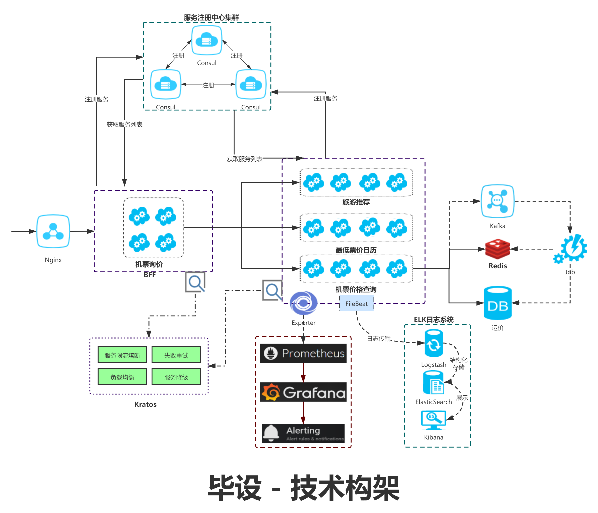

# go 进阶训练营 毕业项目

## 毕设要求

对当下自己项目中的业务，进行一个微服务改造，需要考虑如下技术点：

1）微服务架构（BFF、Service、Admin、Job、Task 分模块）

2）API 设计（包括 API 定义、错误码规范、Error 的使用）

3）gRPC 的使用

4）Go 项目工程化（项目结构、DI、代码分层、ORM 框架）

5）并发的使用（errgroup 的并行链路请求

6）微服务中间件的使用（ELK、Opentracing、Prometheus、Kafka）

7）缓存的使用优化（一致性处理、Pipeline 优化）

## 思路

### 业务场景 - 航空机票询价服务（ShoppingService）

- 机票询价接口返回下述三项信息，这三项信息分别由二个服务的三个不同的接口提供(Shopping)

    - 查询票价返回指定航线和日期的票价（FareService.Pring）
    - 返回指定航线前后一周的最低日历(FareService.PriceCalendar)
    - 返回目的地的旅游推荐(Travel.Query)

- 机票询价接口属于BFF层，使用errgroup查询三个接口，三个接口查询均成功，然后聚合数据
- 查询票价，先查询缓存，未命中，再查询DB，然后给MQ发一条构建缓存的任务
- 票价缓存更新JOB，消费MQ中的构建任务，从DB中捞出信息打到Redis中

### 架构设计



## TODO

1. [X] 票价、日历和旅游推荐接口设计

2. [X] 询价服务API设计

3. [X] 表结构设计

4. [X] 票价查询实现

5. [X] 日历和旅游推荐实现

6. [X] 缓存更新JOB

7. [x] 测试

## 参考

- [Go-gRPC 实践指南](https://www.bookstack.cn/read/go-grpc/summary.md)
- [Protocol Buffers](https://github.com/protocolbuffers/protobuf/releases)
- [kratos blog示例](https://github.com/go-kratos/kratos/blob/main/examples/blog)
- [ent文档](https://entgo.io/zh/docs/getting-started)

## 编译

### kratos生成接口

```sh
cd api\fare\v1
kratos proto client fare.proto --proto_path=../../../third_party --proto_path=../.. -I=.
```

### ent

1. 生成结构 Fare 于 `<project>/ent/schema/` 目录内 `ent init Fare`

2. 生成对DB的各种操作`ent generate ./ent/schema`

### conf

```sh
protoc --go_out=. --proto_path=../../third_party -I=. conf.proto
```

### 项目编译

```sh
cd cmd\fare
#生成注入代码
wire
go build github.com/webmin7761/go-school/homework/final/cmd/fare

cd cmd\shop
#生成注入代码
wire
go build github.com/webmin7761/go-school/homework/final/cmd/shop

cd cmd\travel
#生成注入代码
wire
go build github.com/webmin7761/go-school/homework/final/cmd/travel

cd cmd\job
wire
go build github.com/webmin7761/go-school/homework/final/cmd/job
```

### 运行项目

```sh
shop -conf ../../configs/shop/config.yaml 
travel -conf ../../configs/travel/config.yaml
fare -conf ../../configs/fare/config.yaml
job -conf ../../configs/job/config.yaml
```

## 测试

- [Postman测试用例](test/data/go-school-final.postman_collection.json)