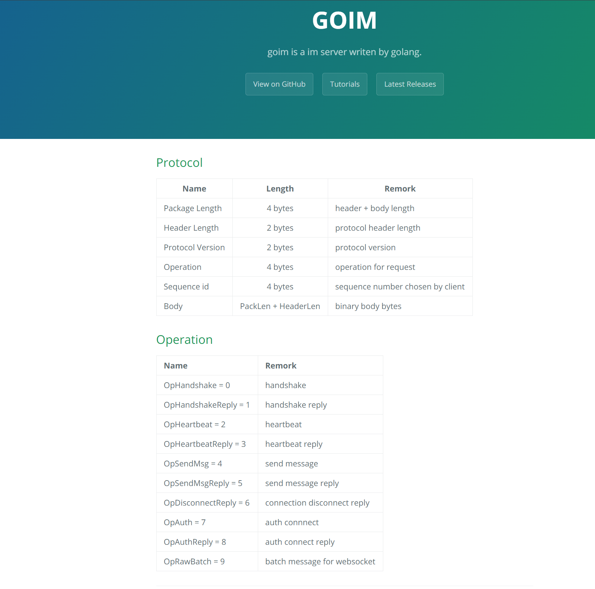

# WEEK-9

1. 总结几种 socket 粘包的解包方式: fix length/delimiter based/length field based frame decoder。尝试举例其应用
```text
1. fix length
    消息定长
    无论一次接收到多少数据报，该方式都会按照设置的固定长度进行解码; 
    如果是半包消, 那么会缓存当前包并等待下个包到达后进行拼包, 直到获取到指定长度的一个完整包;
    应用场景:
        运用于数据长度固定的粘包拆包场景, 比如指令发送
    
2. delimiter based
    设置消息边界
    服务端从网络流中按消息边界分离出消息内容。在包尾增加回车换行符或其他特殊字符进行分割，例如FTP协议。

3. length field based frame decoder
    基于数据包长度的解码
    将应用层数据包的长度，作为接收端应用层数据包的拆分依据。 按照应用层数据包的大小，拆包。 
    这个拆包器，有一个要求，就是应用层协议中包含数据包的长度。
    处理粘拆包的主要思想是在生成的数据包中添加一个长度字段，用于记录当前数据包的长度。 
    LengthFieldBasedFrameDecoder会按照参数指定的包长度偏移量数据对接收到的数据进行解码，从而得到目标消息体数据;
```

2. 实现一个从 socket connection 中解码出 goim 协议的解码器。[web_goim协议](https://goim.io/docs/protocol.html)


代码:
1. 客户端: [client/main.go](./cmd/client/main.go)
2. 服务端: [server/main.go](./cmd/server/main.go)
3. goim自定义解码器: [goim.go](./goim.go)

说明:

    服务端采用`goim`原生自带的写入api进行写入;

    客户端采用自实现的解码器进行解码;


| 输入 | 输出 |
|:---|:---|
|0|{"ProtocolVersion":1,"Operation":4,"Seq":4,"Content":"send message"}|
|1|{"ProtocolVersion":1,"Operation":0,"Seq":1,"Content":"hand shake...."}|
|2|{"ProtocolVersion":1,"Operation":1,"Seq":2,"Content":"hand shake reply"}|
|其他|{"ProtocolVersion":1,"Operation":4,"Seq":4,"Content":"send message"}|
